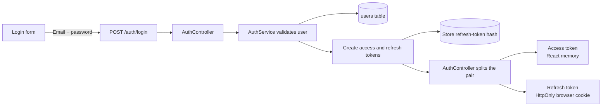
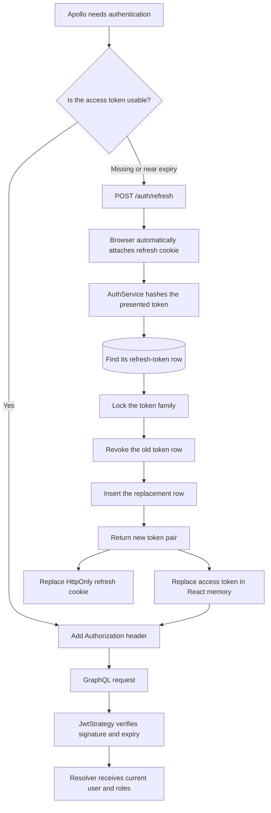
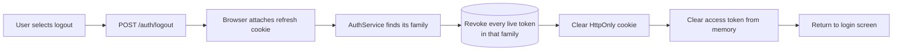
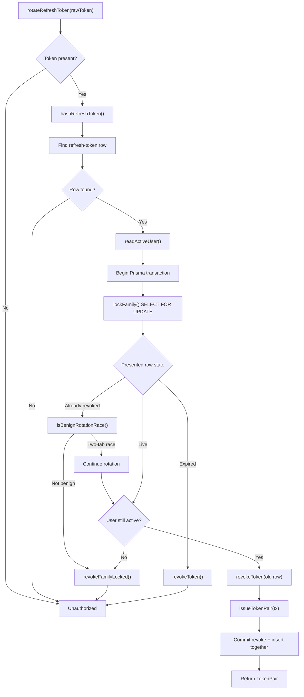

# Authentication and refresh sessions — learning guide

This is the single starting point for learning the authentication implementation
on `feature/authentication-mfa`. Open this file first, then follow only the code
links for the flow being studied. The feature record and technical plan remain
the authorities for status, decisions, verification, and future phases; this
guide exists to teach how the implemented code works.

## Current scope

Implemented: login, slim access JWTs, refresh-token cookies, rotation, page-reload
restoration, automatic HTTP renewal, authenticated WebSocket reconnects, logout,
two-tab grace handling, theft-triggered family revocation, CORS allowlisting, and
origin checks on the cookie endpoints.

Still pending: user-run acceptance of Phases 0–1.6. Phase 2 (throttling and
account lockout) and Phase 3 (TOTP MFA and recovery codes) are not implemented.

## Vocabulary

| Term | Meaning in this project |
|---|---|
| Access token | A short-lived signed JWT. React keeps it in memory and Apollo sends it with GraphQL operations. |
| Refresh token | A long-lived random secret used only to obtain another token pair. It is not a JWT. |
| Refresh cookie | The browser-controlled, httpOnly container carrying the raw refresh token. React cannot read or delete it. |
| Refresh-token hash | The SHA-256 digest stored in MySQL. A database dump does not contain the usable raw token. |
| Rotation | Spending one refresh token and issuing its replacement. The old row remains as revoked history. |
| Family | Every refresh-token row descended from one login. One family represents one device/session. |
| Revocation | Marking a token or every token in a family unusable by setting `revoked_at`. |
| `req.user` | The authenticated `{ id, email, role_ids }` object created after `JwtStrategy` verifies the access JWT. |

The shortest mental model is: **the access token opens normal API requests; the
refresh cookie renews access; the database decides whether the session is still
alive.**

## Visual flows

### Signing in



### Using and refreshing the session



A reload follows the **missing access token** path: JavaScript memory was erased,
but the browser may still hold the refresh cookie.

### Logging out



## Numbered code-reading path

Do not begin by reading all of `auth.service.ts`. Follow one request across the
frontend/backend boundary at a time.

### 1. Follow login end to end

Read in this order:

1. [`login-form.tsx`](../../react-inopack/src/app/app/authorization-wrapper/login-form.tsx)
   — captures the email/password and calls `loginWithPassword`.
2. [`access-token.ts`](../../react-inopack/src/services/auth/access-token.ts)
   — `loginWithPassword` sends `POST /auth/login` and adopts the access token.
3. [`auth.controller.ts`](../../nestjs-inopack-graphql/src/modules/auth/auth.controller.ts)
   — receives REST and puts one token in JSON and the other in a cookie.
4. [`auth.service.ts`](../../nestjs-inopack-graphql/src/modules/auth/auth.service.ts)
   — initially read only `validateUser`, `loginWithCredentials`,
   `issueTokenPair`, `signAccessToken`, and `hashRefreshToken`.
5. [`refresh-cookie.ts`](../../nestjs-inopack-graphql/src/modules/auth/refresh-cookie.ts)
   — shows how the browser-owned cookie is set.

Checkpoint: **Where are the raw access and refresh tokens after login, and what
does MySQL store?**

### 2. Follow a page reload

1. [`authorization-wrapper.tsx`](../../react-inopack/src/app/app/authorization-wrapper/authorization-wrapper.tsx)
   — startup state: loader, login form, or application.
2. `bootstrapSession` and `refreshAccessToken` in
   [`access-token.ts`](../../react-inopack/src/services/auth/access-token.ts).
3. `refresh` in
   [`auth.controller.ts`](../../nestjs-inopack-graphql/src/modules/auth/auth.controller.ts).
4. `rotateRefreshToken` in
   [`auth.service.ts`](../../nestjs-inopack-graphql/src/modules/auth/auth.service.ts).

Checkpoint: **React lost the access token during reload, so how can it obtain
another without reading the refresh token?**

### 3. Follow an authenticated GraphQL request

1. `ensureAccessToken` in
   [`access-token.ts`](../../react-inopack/src/services/auth/access-token.ts).
2. `authLink` and `splitLink` in
   [`init-apollo-client.ts`](../../react-inopack/src/services/apollo/init-apollo-client.ts).
3. [`jwt.strategy.ts`](../../nestjs-inopack-graphql/src/modules/auth/strategies/jwt.strategy.ts).
4. [`gql-roles.guard.ts`](../../nestjs-inopack-graphql/src/modules/auth/guards/gql-roles.guard.ts).

Checkpoint: **Which credential is sent with GraphQL, who verifies it, and how do
resolvers receive `currentUser.id` and the role ids?**

### 4. Understand automatic renewal

Read `readExpiry`, `hasUsableToken`, `refreshAccessToken`, and
`ensureAccessToken` in
[`access-token.ts`](../../react-inopack/src/services/auth/access-token.ts), then
`errorLink` and `connectionParams` in
[`init-apollo-client.ts`](../../react-inopack/src/services/apollo/init-apollo-client.ts).

- Proactive: the access token is missing or near expiry.
- Reactive: GraphQL rejects it, so `errorLink` refreshes and replays once.
- WebSocket: `connectionParams` obtains a usable token during each reconnect.

Checkpoint: **Why does `refreshInFlight` make every concurrent request share one
refresh instead of sending several `/auth/refresh` calls?**

### 5. Follow logout

Read the logout callback in
[`inopack-drawer.tsx`](../../react-inopack/src/app/app/inopack-drawer/inopack-drawer.tsx),
then `logoutSession` in
[`access-token.ts`](../../react-inopack/src/services/auth/access-token.ts),
`logout` in
[`auth.controller.ts`](../../nestjs-inopack-graphql/src/modules/auth/auth.controller.ts),
and `logout` / `revokeFamily` in
[`auth.service.ts`](../../nestjs-inopack-graphql/src/modules/auth/auth.service.ts).

Checkpoint: **Why is clearing React memory insufficient, and why must the server
revoke the family before the UI reloads?**

### 6. Study concurrency last

Only after steps 1–5, read these methods in
[`auth.service.ts`](../../nestjs-inopack-graphql/src/modules/auth/auth.service.ts):

- `lockFamily`
- `revokeFamilyLocked`
- `isBenignRotationRace`
- `revokeAllForUser`

They handle two tabs refreshing the shared cookie and logout arriving while a
rotation is in progress.

Checkpoint: **What could happen if rotation revoked the old row and inserted its
successor as unrelated database operations?**

## Function-by-function runtime flow

### 1. Application startup or reload

```text
AuthorizationWrapper
  -> useEffect()
  -> bootstrapSession()
  -> refreshAccessToken()
  -> fetch(POST /auth/refresh, credentials: include)
  -> AllowedOriginGuard.canActivate()
  -> AuthController.refresh()
  -> readRefreshCookie() + sessionMeta()
  -> AuthService.rotateRefreshToken()
```

On success:

```text
rotateRefreshToken()
  -> TokenPair
  -> AuthController.respondWithPair()
  -> setRefreshCookie()
  -> JSON { accessToken }
  -> adoptToken()
  -> setIsSessionBootstrapped(true)
  -> useCurrentUserQuery()
```

`currentUser` renders the application. A rejected cookie renders `LoginForm`.
A network/500 failure clears the unusable access token but keeps the session
retryable.

### 2. Login

```text
LoginForm.handleSubmit()
  -> loginWithPassword(email, password)
  -> POST /auth/login
  -> AllowedOriginGuard.canActivate()
  -> AuthController.login()
  -> readCredentials() + sessionMeta()
  -> AuthService.loginWithCredentials()
  -> validateUser()
      -> users.findFirst(active = 1, active user_roles)
      -> bcrypt.compare(password)
  -> delete expired refresh rows for the user
  -> issueTokenPair(new family_id)
      -> randomBytes() creates the raw refresh token
      -> hashRefreshToken() creates its SHA-256 digest
      -> refresh_tokens.create()
      -> signAccessToken()
  -> AuthController.respondWithPair()
      -> setRefreshCookie(refreshToken)
      -> return JSON { accessToken }
  -> adoptToken(accessToken)
  -> Apollo client.resetStore()
  -> currentUser query
```

### 3. Normal GraphQL query or mutation

```text
splitLink
  -> non-subscription path
  -> authLink
      -> ensureAccessToken()
      -> hasUsableToken()
      -> Authorization: Bearer <access token>
  -> errorLink
  -> httpLink
  -> GqlAuthGuard / Passport
  -> JwtStrategy verifies signature and expiry
  -> JwtStrategy.validate()
  -> req.user = { id, email, role_ids }
  -> GqlRolesGuard
  -> resolver receives @CurrentUser()
```

The refresh cookie is scoped to `/auth`, so it is not sent to `/graphql`.

### 4. Automatic refresh

Proactive path:

```text
ensureAccessToken()
  -> hasUsableToken() is false
  -> sessionKnownDead is false
  -> refreshAccessToken()
```

Reactive HTTP path:

```text
errorLink receives an unauthenticated response
  -> reject if this operation already retried
  -> refreshAccessToken()
  -> replace Authorization header
  -> forward(operation) once
```

Single-flight behavior:

```text
first caller -> creates refreshInFlight Promise
later callers -> return the same Promise
completion -> refreshInFlight = null
```

### 5. Backend rotation decision tree



Failure branches return `null` inside the transaction so revocation commits;
`UnauthorizedException` is thrown only after the transaction completes.

### 6. WebSocket subscriptions

```text
splitLink
  -> subscription path
  -> wsLink
  -> graphql-ws createClient()
  -> connectionParams()
  -> ensureAccessToken()
```

- Usable token: connect with `Bearer <token>`.
- Known-dead session: connect anonymously for login-screen subscriptions.
- Transient refresh failure: throw a plain `Error`; graphql-ws retries.

After a reconnect, `apolloClient.refetchQueries({ include: 'active' })`
reconciles data missed while the socket was disconnected.

### 7. Logout

```text
InopackDrawer confirmation
  -> logoutSession()
  -> POST /auth/logout, credentials: include
  -> AllowedOriginGuard.canActivate()
  -> AuthController.logout()
  -> readRefreshCookie()
  -> AuthService.logout()
  -> find refresh-token row
  -> revokeFamily()
      -> transaction
      -> lockFamily()
      -> revokeFamilyLocked()
  -> clearRefreshCookie()
  -> { success: true }
  -> adoptToken(null, true)
  -> window.location.reload()
  -> bootstrap refresh returns 401
  -> LoginForm
```

### Supporting configuration and protection

```text
jwtConstants
  -> environment-backed secrets and lifetimes

main.bootstrap()
  -> corsOrigins()
  -> enableCors({ credentials: true })

AllowedOriginGuard
  -> isAllowedOrigin()
  -> protects /auth/login, /auth/refresh, /auth/logout

refresh-cookie.ts
  -> setRefreshCookie()
  -> readRefreshCookie()
  -> clearRefreshCookie()
```

## Tests — later learning pass

Once the runtime path can be explained in plain language, use this order:

1. `validates user` cases in
   [`auth.service.test.ts`](../../nestjs-inopack-graphql/src/modules/auth/auth.service.test.ts).
2. Basic issue, rotate, and logout cases.
3. Reuse/theft and grace-window cases.
4. The two deliberately interleaved race cases.
5. The direct family-lock contention test.
6. [`auth.controller.test.ts`](../../nestjs-inopack-graphql/src/modules/auth/auth.controller.test.ts)
   for the REST boundary.

For each test, identify the production behavior it protects and the broken
implementation that would make it fail.

## Not implemented yet

- Per-IP login and refresh throttling.
- Failed-password counters and temporary account lockout.
- TOTP enrollment and verification.
- Recovery codes and MFA login tokens.
- Scheduled cleanup of expired refresh-token rows.

## Deeper references

- [Feature record](../features/ongoing/feature-authentication-mfa.md) — status,
  decisions, verification, deployment prerequisites, and remaining work.
- [Technical plan](../plans/ongoing/auth-refresh-throttling-mfa.md) — full design,
  review findings, rollout sequencing, and future phases.
- [`jwt.ts`](../../nestjs-inopack-graphql/src/common/constants/jwt.ts) — token
  lifetimes and environment-backed secrets.
- [`schema.prisma`](../../nestjs-inopack-graphql/prisma/schema.prisma) — the
  `refresh_tokens` model and relation to `users`.
- [`1788804218804-CreateRefreshTokens.ts`](../../nestjs-inopack-graphql/src/db/migrations/1788804218804-CreateRefreshTokens.ts)
  — the database table and indexes.
